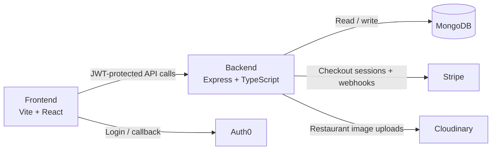

# HashEats 🍔

> A full-stack food ordering platform for customers, restaurant owners, and order tracking.


---

## Overview

HashEats lets customers search restaurants by city, browse menus, and place orders through a Stripe-powered checkout. Restaurant owners get a protected dashboard to create and manage their restaurant profile, update menus, and track incoming orders in real time. The backend persists data in MongoDB, uploads restaurant images to Cloudinary, and validates access using Auth0-issued JWTs. In production, the Express server also serves the compiled React frontend from `frontend/dist` as a unified monolith.

---

## Architecture



---

## Features

- ✅ Auth0 login with protected customer and owner routes
- ✅ Restaurant search by city, cuisine, query, sort, and pagination
- ✅ Restaurant detail pages with cart, delivery summary, and Stripe checkout
- ✅ Webhook-based order confirmation after successful payment
- ✅ Owner dashboard for restaurant creation, menu updates, and order status management
- ✅ Cloudinary-backed image uploads for restaurant media

---

## Monorepo Structure

```text
HashEats/
├── backend/                 # Express + TypeScript API
│   ├── src/
│   │   ├── controllers/     # Route handlers
│   │   ├── middleware/       # Auth, error handling, file parsing
│   │   ├── models/           # Mongoose schemas
│   │   ├── routes/           # Express routers
│   │   └── index.ts          # App entry point
│   ├── .env
│   └── package.json
├── frontend/                # Vite + React SPA
│   ├── src/
│   │   ├── components/       # Shared UI components
│   │   ├── pages/            # Route-level pages
│   │   ├── api/              # API client hooks (React Query)
│   │   └── main.tsx          # App entry point
│   ├── .env
│   └── package.json
└── README.md
```

---

## Prerequisites

- Node.js 22+
- npm
- MongoDB connection string (Atlas or local)
- Auth0 application and API credentials
- Stripe account, secret key, and webhook signing secret
- Cloudinary account credentials

---

## Quick Start

1. **Clone the repository**
   ```bash
   git clone https://github.com/hashamtanveer-41/Food-Ordering-App-MERN.git
   cd Food-Ordering-App-MERN
   ```

2. **Install backend dependencies**
   ```bash
   cd backend && npm install
   ```

3. **Install frontend dependencies**
   ```bash
   cd ../frontend && npm install
   ```

4. **Configure environment variables** — create `backend/.env` and `frontend/.env` using the tables below.

5. **Start the backend** (terminal 1)
   ```bash
   cd backend && npm run dev
   ```

6. **Start the frontend** (terminal 2)
   ```bash
   cd frontend && npm run dev
   ```

7. Open `http://localhost:5173`

---

## Environment Variables

### Backend — `backend/.env`

| Variable | Description | Example |
|---|---|---|
| `MONGODB_URI` | MongoDB connection string | `mongodb+srv://<user>:<pass>@cluster.mongodb.net/hasheats` |
| `AUTH0_AUDIENCE` | Auth0 API audience for token validation | `https://hasheats-api` |
| `AUTH0_ISSUER_BASE_URL` | Auth0 tenant issuer URL | `https://dev-example.us.auth0.com/` |
| `CLOUDINARY_CLOUD_NAME` | Cloudinary cloud name | `hasheats-cloud` |
| `CLOUDINARY_API_KEY` | Cloudinary API key | `123456789012345` |
| `CLOUDINARY_API_SECRET` | Cloudinary API secret | `cloudinary-secret` |
| `STRIPE_SECRET_KEY` | Stripe secret key for checkout sessions | `sk_test_...` |
| `STRIPE_SECRET_WEBHOOK` | Stripe webhook signing secret | `whsec_...` |
| `FRONTEND_URL` | Frontend origin for Stripe redirects | `http://localhost:5173` |

### Frontend — `frontend/.env`

| Variable | Description | Example |
|---|---|---|
| `VITE_API_BASE_URL` | Backend API base URL | `http://localhost:8000` |
| `VITE_AUTH0_DOMAIN` | Auth0 tenant domain | `dev-example.us.auth0.com` |
| `VITE_AUTH0_CLIENT_ID` | Auth0 SPA client ID | `abc123def456` |
| `VITE_AUTH0_CALLBACK_URL` | Post-login redirect URL | `http://localhost:5173/auth-callback` |
| `VITE_AUTH0_AUDIENCE` | Auth0 audience for API tokens | `https://hasheats-api` |

> ⚠️ Vite bakes environment variables into the static build at compile time. If you change a `VITE_*` variable in production, trigger a full rebuild — runtime changes alone won't be picked up by the deployed frontend.

---

## 🧠 Technical Challenges & Lessons Learned

Building HashEats involved navigating several complex integration and deployment challenges. These are documented here as a reflection of the debugging process and key architectural decisions made throughout development.

### 💳 Stripe Payment Integration

- **Smallest currency unit mismatch** — Stripe expects amounts in the smallest unit (paisa for PKR, cents for USD). Fixed by computing `Math.round(price * 100)` in the checkout controller before constructing line items, eliminating floating-point errors.

- **Empty cart crash** — The backend threw a `line_items parameter is required` error when the frontend sent an empty cart. Fixed with a guard that validates cart length and returns a clean `400 Bad Request` before touching the Stripe API.

- **Webhook signature verification failure** — Webhooks failed with `Payload was provided as a parsed JavaScript object` because the global `express.json()` middleware was converting the raw buffer before Stripe could verify the cryptographic signature. Fixed by extracting the webhook route to the root app level, applying `express.raw({ type: 'application/json' })` specifically to that route, and placing it *above* the global JSON parser.

- **Webhook route path mismatch** — A plural vs. singular path conflict (`/api/orders` vs `/api/order`) caused the raw parser to be bypassed entirely. Fixed by defining the webhook endpoint directly on the root app rather than inside the modular router.

### ⚙️ Monolith Deployment on Render

- **Incorrect static file path** — The backend threw `ENOENT: no such file or directory` when trying to serve the React build. Because the compiled `index.js` lives in `backend/dist/`, the relative path needed to go up two levels (`'../../frontend/dist'`) instead of one.

- **Env variable build lifecycle** — Auth0 callbacks were redirecting production users to `localhost:5173`. Vite bakes environment variables at build time, so runtime changes don't affect an already-compiled frontend. Fixed by syncing the live Render URL across Render's env config, the Auth0 dashboard (Allowed Callbacks + Origins), and the Stripe webhook dashboard, then triggering a manual rebuild.

### ⚛️ TypeScript Strictness

- **Object casting in webhook handlers** — TypeScript rejected `err?.message` and `event.data.object` access in strict mode. Fixed by typing caught exceptions as `Error` and casting Stripe event objects (e.g., `event.data.object as Stripe.Checkout.Session`) to safely access nested fields.

- **Deprecated Radix UI props** — Upgrading Select components to Base UI triggered prop errors for `position="popper"`. Fixed by removing the legacy Radix positioning prop and using Base UI's native `side`, `sideOffset`, and `align` APIs.

- **TypeScript 6.0 `baseUrl` deprecation** — The build pipeline broke because TypeScript 6.0 dropped the `baseUrl` property in `tsconfig.json`. Fixed by removing it and switching to modern Vite path aliasing.

### 🛠️ Git

- **Stale tracking cache** — `.gitignore` failed to exclude `node_modules` because files were already tracked. Fixed by running `git rm -r --cached .` to clear the index, then re-staging and committing the deletions.

- **Corrupted Git object database** — A system crash corrupted `.git/objects`, producing `fatal: unable to read tree`. Fixed by saving uncommitted changes manually, cloning a fresh copy from the remote, and merging the local changes into the healthy repository.

---

## Project Docs

- [Backend README](./backend/README.md)
- [Frontend README](./frontend/README.md)

---

## Deployment Overview

The repo does not prescribe a single deployment target. The backend can run as a Node.js service on any platform supporting port `8000` (Render, EC2, Railway, etc.), and the frontend can be deployed as a static Vite build (Netlify, Vercel) or served directly by the Express backend from `frontend/dist` in a monolith setup. See the individual READMEs for platform-specific steps.

---

## Contributing

1. Create a feature branch off `main`.
2. Make focused, well-scoped commits with clear messages.
3. Update documentation when behavior or setup changes.
4. Open a pull request with a concise summary and screenshots where relevant.

---

## License

No license file is currently included. Add one before distributing or accepting external contributions.