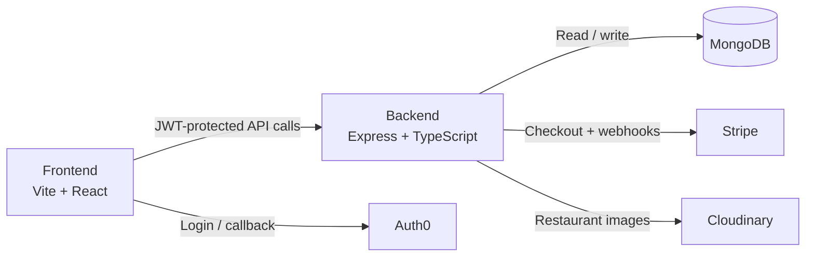

# HashEats
A full-stack food ordering platform for customers, restaurant owners, and order tracking.


HashEats lets customers search restaurants by city, browse menus, and place orders through Stripe checkout. Restaurant owners can create and update a restaurant profile, manage menu items, and track incoming orders from a protected dashboard. The backend stores data in MongoDB, uploads restaurant images to Cloudinary, and validates access with Auth0-issued JWTs. In production, the Express server also serves the built frontend from `frontend/dist`.



## Features
- ✅ Auth0 login with protected customer and owner routes
- ✅ Restaurant search by city, cuisine, query, sort, and pagination
- ✅ Restaurant detail pages with cart, delivery summary, and checkout
- ✅ Stripe payment flow with webhook-based order confirmation
- ✅ Owner dashboard for restaurant creation, updates, and order status management
- ✅ Cloudinary-backed image uploads for restaurant media

## Monorepo structure
```text
HashEats/
├── backend/                 # Express + TypeScript API, MongoDB models, Stripe + Cloudinary integration
│   ├── src/
│   └── package.json
├── frontend/                # Vite + React UI, Auth0 login, search, cart, and dashboard screens
│   ├── src/
│   └── package.json
└── README.md                # Project overview and setup
```

## Prerequisites
- Node.js 22+
- npm
- MongoDB connection string
- Auth0 application and API settings
- Stripe account and webhook secret
- Cloudinary account credentials

## Quick Start
1. Clone the repository.
   ```bash
   git clone https://github.com/hashamtanveer-41/Food-Ordering-App-MERN.git
   cd Food-Ordering-App-MERN
   ```
2. Install backend dependencies.
   ```bash
   cd backend
   npm install
   ```
3. Install frontend dependencies.
   ```bash
   cd ../frontend
   npm install
   ```
4. Create `backend/.env` and `frontend/.env` using the tables below.
5. Start the backend in one terminal.
   ```bash
   cd backend
   npm run dev
   ```
6. Start the frontend in a second terminal.
   ```bash
   cd frontend
   npm run dev
   ```
7. Open `http://localhost:5173`.

## Environment Variables

### Backend
| Variable | Description | Example |
| --- | --- | --- |
| `MONGODB_URI` | MongoDB connection string used by Mongoose | `mongodb+srv://<user>:<password>@cluster.mongodb.net/hasheats` |
| `AUTH0_AUDIENCE` | Auth0 API audience used to validate access tokens | `https://hasheats-api` |
| `AUTH0_ISSUER_BASE_URL` | Auth0 issuer URL for JWT validation | `https://dev-example.us.auth0.com/` |
| `CLOUDINARY_CLOUD_NAME` | Cloudinary cloud name for image uploads | `hasheats-cloud` |
| `CLOUDINARY_API_KEY` | Cloudinary API key | `123456789012345` |
| `CLOUDINARY_API_SECRET` | Cloudinary API secret | `cloudinary-secret` |
| `STRIPE_SECRET_KEY` | Stripe secret key used to create checkout sessions | `sk_test_...` |
| `STRIPE_SECRET_WEBHOOK` | Stripe webhook signing secret for checkout events | `whsec_...` |
| `FRONTEND_URL` | Public frontend URL used in Stripe success/cancel redirects | `http://localhost:5173` |

### Frontend
| Variable | Description | Example |
| --- | --- | --- |
| `VITE_API_BASE_URL` | Base URL for the backend API | `http://localhost:8000` |
| `VITE_AUTH0_DOMAIN` | Auth0 tenant domain | `dev-example.us.auth0.com` |
| `VITE_AUTH0_CLIENT_ID` | Auth0 SPA client ID | `abc123def456` |
| `VITE_AUTH0_CALLBACK_URL` | Redirect URL after Auth0 login | `http://localhost:5173/auth-callback` |
| `VITE_AUTH0_AUDIENCE` | Auth0 audience for API tokens | `https://hasheats-api` |

## Project Docs
- [Backend README](./backend/README.md)
- [Frontend README](./frontend/README.md)

## Deployment Overview
The repo does not prescribe a single deployment platform. The backend can run as a Node service on any host that supports port `8000`, and the frontend can be deployed as a static Vite build or served by the backend from `frontend/dist`. For environment-specific deployment details, see the backend and frontend READMEs.

## Contributing
1. Create a feature branch.
2. Make focused changes with clear commits.
3. Update documentation when behavior or setup changes.
4. Open a pull request with a concise summary and screenshots where relevant.

## License
No license file is included in this repository. Add one before distributing or accepting external contributions.
