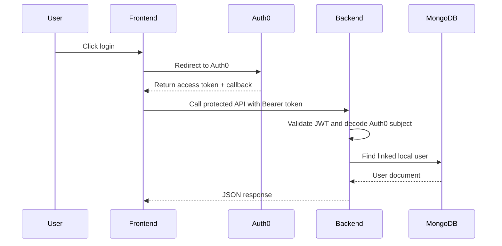

# HashEats — Backend


This service powers authentication-aware restaurant search, restaurant management, and order placement. It connects to MongoDB through Mongoose, uploads restaurant images to Cloudinary, and creates Stripe checkout sessions with webhook-driven payment updates. Protected routes use Auth0 JWT validation plus a local user lookup to map Auth0 identities to app users.

## Directory Structure
```text
src/
├── controllers/        # Request handlers for users, restaurants, and orders
├── middlewares/        # JWT auth and request validation helpers
├── models/             # Mongoose schemas for users, restaurants, and orders
├── routes/             # Express route declarations
└── index.ts            # Server bootstrap, MongoDB connection, Cloudinary config, static hosting
```

## Environment Variables
| Variable | Required | Description | Example |
| --- | --- | --- | --- |
| `MONGODB_URI` | Yes | MongoDB connection string | `mongodb+srv://<user>:<password>@cluster.mongodb.net/hasheats` |
| `AUTH0_AUDIENCE` | Yes | Auth0 API audience for JWT validation | `https://hasheats-api` |
| `AUTH0_ISSUER_BASE_URL` | Yes | Auth0 issuer base URL | `https://dev-example.us.auth0.com/` |
| `CLOUDINARY_CLOUD_NAME` | Yes | Cloudinary cloud name for image uploads | `hasheats-cloud` |
| `CLOUDINARY_API_KEY` | Yes | Cloudinary API key | `123456789012345` |
| `CLOUDINARY_API_SECRET` | Yes | Cloudinary API secret | `cloudinary-secret` |
| `STRIPE_SECRET_KEY` | Yes | Stripe secret key used to create checkout sessions | `sk_test_...` |
| `STRIPE_SECRET_WEBHOOK` | Yes | Stripe webhook signing secret | `whsec_...` |
| `FRONTEND_URL` | Yes | Public frontend URL used in Stripe redirects | `http://localhost:5173` |

## Local Development Setup
1. Install dependencies.
   ```bash
   npm install
   ```
2. Create `backend/.env` with the variables listed above.
3. Start the API in development mode.
   ```bash
   npm run dev
   ```
4. Verify the server is reachable.
   ```bash
   curl http://localhost:8000/health
   ```
5. Keep the Stripe CLI session running; the `dev` script already starts `stripe listen` and forwards webhooks to `/api/order/checkout/webhook`.

## Docker
The repository does not ship Docker files, but the current API can be containerized with a minimal setup.

```dockerfile
FROM node:22-alpine

WORKDIR /app
COPY package*.json ./
RUN npm install

COPY . .
EXPOSE 8000
CMD ["npm", "run", "start"]
```

```yaml
services:
  backend:
    build: ./backend
    ports:
      - "8000:8000"
    env_file:
      - ./backend/.env
```

## API Reference

### Health
| Method | Endpoint | Auth Required | Description |
| --- | --- | --- | --- |
| `GET` | `/health` | No | Health check endpoint. |

### Users
| Method | Endpoint | Auth Required | Description |
| --- | --- | --- | --- |
| `GET` | `/api/users` | Yes | Fetch the current authenticated user profile. |
| `POST` | `/api/users` | Yes | Create a new user record after Auth0 callback. |
| `PUT` | `/api/users` | Yes | Update the current user profile. |

### Restaurants
| Method | Endpoint | Auth Required | Description |
| --- | --- | --- | --- |
| `GET` | `/api/restaurants` | Yes | Fetch the authenticated owner’s restaurant. |
| `POST` | `/api/restaurants` | Yes | Create a restaurant with an uploaded image. |
| `PUT` | `/api/restaurants` | Yes | Update the authenticated owner’s restaurant. |
| `GET` | `/api/restaurants/order` | Yes | List orders for the authenticated owner’s restaurant. |
| `GET` | `/api/restaurants/search/:city` | No | Search restaurants by city, cuisine, query, sort, and pagination. |
| `GET` | `/api/restaurants/:restaurantId` | No | Fetch a restaurant by ID. |
| `PATCH` | `/api/restaurants/order/:orderId/status` | Yes | Update an order’s status. |

### Orders
| Method | Endpoint | Auth Required | Description |
| --- | --- | --- | --- |
| `GET` | `/api/order` | Yes | List orders for the current user. |
| `POST` | `/api/order/checkout/create-checkout-session` | Yes | Create a Stripe checkout session and persist a pending order. |
| `POST` | `/api/order/checkout/webhook` | No | Stripe webhook receiver that marks paid orders. |

## Database Schema Overview
| Collection | Key Fields | Notes |
| --- | --- | --- |
| `User` | `auth0Id`, `email`, `name`, `addressLine1`, `city`, `country` | Maps Auth0 identities to application users. |
| `Restaurant` | `user`, `restaurantName`, `city`, `country`, `deliveryPrice`, `estimatedDeliveryTime`, `cuisines`, `menuItems`, `imageUrl`, `lastUpdate` | One restaurant per owner account. |
| `Order` | `restaurant`, `user`, `deliveryDetails`, `cartItems`, `totalAmount`, `status`, `createdAt` | Stores checkout data and order progress. |

## Auth Flow
Auth0 issues the access token on the frontend. The backend validates the token signature with `jwtCheck`, decodes the `sub` claim in `jwtParse`, and resolves that Auth0 subject to a local `User` document. Protected routes then use `req.userId` for owner-specific restaurant and order queries.



## Error Handling
Controllers wrap request handling in `try/catch` blocks and return JSON errors with appropriate HTTP status codes. Validation failures are surfaced by `express-validator` through shared middleware, while the global error handler in `index.ts` normalizes unexpected errors into `{ success, statusCode, message }` responses. Stripe webhook failures and auth failures are returned explicitly rather than swallowed.

## Testing Instructions
No automated backend test script is defined in `package.json`. Use the health endpoint and targeted API calls from Postman, Insomnia, or curl to smoke-test auth, restaurant management, and checkout flows.

## Deployment Notes
- `npm start` runs the TypeScript source through `tsx`.
- The backend serves `frontend/dist` statically, so build the frontend before starting the API in production.
- Use PM2 or a similar process manager on a Node host such as EC2, then place Nginx in front of port `8000` if you need TLS termination or a reverse proxy.
- Configure Stripe webhooks against the public `/api/order/checkout/webhook` URL and set `FRONTEND_URL` to the deployed frontend domain.
