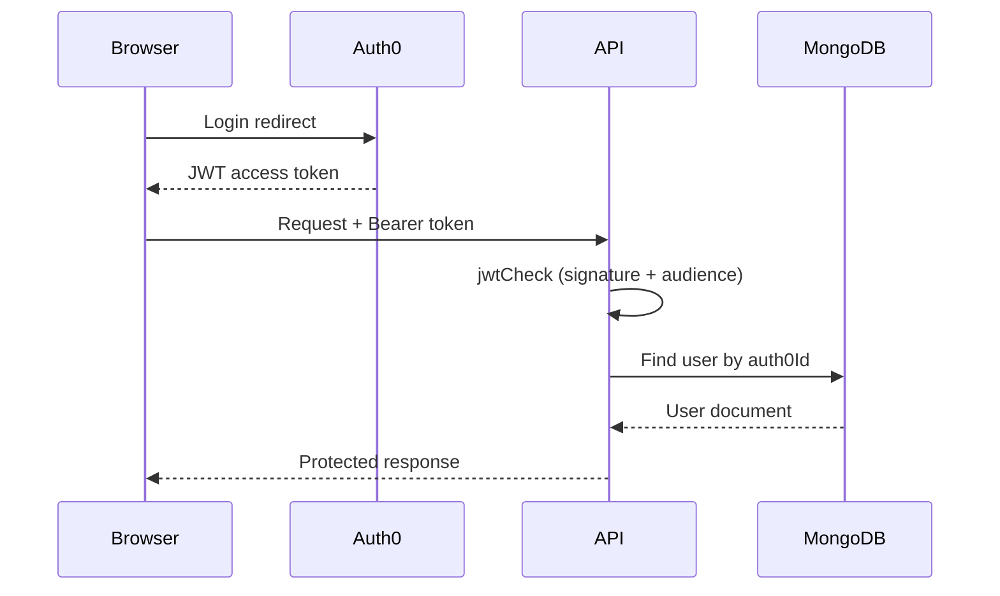

# HashEats — Backend

> Express + TypeScript REST API powering the HashEats food ordering platform.


---

## Overview

This service handles all business logic for HashEats: user and restaurant management, menu operations, order creation, Stripe payment sessions, webhook processing, and Cloudinary image uploads. Auth0-issued JWTs protect all non-public routes. In production, the server also serves the compiled React frontend as a monolith.

---

## Directory Structure

```text
backend/
├── src/
│   ├── controllers/
│   │   ├── AuthController.ts        # User upsert on first Auth0 login
│   │   ├── MyRestaurantController.ts # Owner CRUD for restaurant + menu
│   │   ├── RestaurantController.ts  # Public search and detail endpoints
│   │   └── OrderController.ts       # Stripe checkout, webhook, order status
│   ├── middleware/
│   │   ├── auth.ts                  # Auth0 JWT validation (jwtCheck + jwtParse)
│   │   └── validation.ts            # express-validator middleware chains
│   ├── models/
│   │   ├── user.ts                  # User schema
│   │   ├── restaurant.ts            # Restaurant + MenuItem schemas
│   │   └── order.ts                 # Order schema
│   ├── routes/
│   │   ├── AuthRoute.ts
│   │   ├── MyRestaurantRoute.ts
│   │   ├── RestaurantRoute.ts
│   │   └── OrderRoute.ts
│   └── index.ts                     # App entry — middleware stack, routes, static serving
├── .env
├── Dockerfile
├── package.json
└── tsconfig.json
```

---

## Environment Variables

| Variable | Required | Description | Example |
|---|---|---|---|
| `MONGODB_URI` | ✅ | Mongoose connection string | `mongodb+srv://<user>:<pass>@cluster.mongodb.net/hasheats` |
| `AUTH0_AUDIENCE` | ✅ | Auth0 API audience for JWT validation | `https://hasheats-api` |
| `AUTH0_ISSUER_BASE_URL` | ✅ | Auth0 tenant issuer URL | `https://dev-example.us.auth0.com/` |
| `CLOUDINARY_CLOUD_NAME` | ✅ | Cloudinary cloud identifier | `hasheats-cloud` |
| `CLOUDINARY_API_KEY` | ✅ | Cloudinary API key | `123456789012345` |
| `CLOUDINARY_API_SECRET` | ✅ | Cloudinary API secret | `cloudinary-secret` |
| `STRIPE_SECRET_KEY` | ✅ | Stripe secret key for sessions | `sk_test_...` |
| `STRIPE_SECRET_WEBHOOK` | ✅ | Stripe webhook signing secret | `whsec_...` |
| `FRONTEND_URL` | ✅ | Frontend origin for Stripe redirects | `http://localhost:5173` |
| `PORT` | ❌ | Server port (defaults to `8000`) | `8000` |

---

## Local Development

1. Install dependencies
   ```bash
   cd backend
   npm install
   ```

2. Create the env file
   ```bash
   cp .env.example .env
   # Fill in all required values
   ```

3. Start the dev server with hot reload
   ```bash
   npm run dev
   ```

The API will be available at `http://localhost:8000`.

---

## Running with Docker

```dockerfile
# Dockerfile (already in /backend)
FROM node:22-alpine
WORKDIR /app
COPY package*.json ./
RUN npm ci
COPY . .
RUN npm run build
EXPOSE 8000
CMD ["node", "dist/index.js"]
```

```bash
# Build and run
docker build -t hasheats-backend .
docker run -p 8000:8000 --env-file .env hasheats-backend
```

---

## API Reference

### Auth

| Method | Endpoint | Auth | Description |
|---|---|---|---|
| `POST` | `/api/my/user` | ✅ | Create or update user on first Auth0 login |
| `PUT` | `/api/my/user` | ✅ | Update user profile |
| `GET` | `/api/my/user` | ✅ | Get current authenticated user |

### Restaurant (Owner)

| Method | Endpoint | Auth | Description |
|---|---|---|---|
| `POST` | `/api/my/restaurant` | ✅ | Create a new restaurant |
| `GET` | `/api/my/restaurant` | ✅ | Get the owner's restaurant |
| `PUT` | `/api/my/restaurant` | ✅ | Update restaurant details or menu |
| `GET` | `/api/my/restaurant/order` | ✅ | Get all orders for the owner's restaurant |
| `PATCH` | `/api/my/restaurant/order/:orderId/status` | ✅ | Update an order's status |

### Restaurant (Public)

| Method | Endpoint | Auth | Description |
|---|---|---|---|
| `GET` | `/api/restaurant/search/:city` | ❌ | Search restaurants by city with filters |
| `GET` | `/api/restaurant/:restaurantId` | ❌ | Get a single restaurant with its menu |

### Orders & Payments

| Method | Endpoint | Auth | Description |
|---|---|---|---|
| `POST` | `/api/order/checkout/create-session` | ✅ | Create a Stripe checkout session |
| `POST` | `/api/order/checkout/webhook` | ❌ | Handle Stripe webhook events (raw body required) |
| `GET` | `/api/order` | ✅ | Get all orders for the current user |

> ⚠️ The webhook route uses `express.raw({ type: 'application/json' })` and is registered at the root app level, **above** the global `express.json()` middleware. Do not move it into the modular router.

---

## Database Schema

### User
| Field | Type | Notes |
|---|---|---|
| `auth0Id` | String | Unique — Auth0 `sub` claim |
| `email` | String | Unique |
| `name` | String | |
| `addressLine1` | String | |
| `city` | String | |
| `country` | String | |

### Restaurant
| Field | Type | Notes |
|---|---|---|
| `user` | ObjectId → User | Owner reference |
| `restaurantName` | String | |
| `city` | String | Used for search |
| `country` | String | |
| `deliveryPrice` | Number | In smallest currency unit |
| `estimatedDeliveryTime` | Number | Minutes |
| `cuisines` | String[] | |
| `menuItems` | MenuItem[] | Embedded array |
| `imageUrl` | String | Cloudinary URL |
| `lastUpdated` | Date | |

### Order
| Field | Type | Notes |
|---|---|---|
| `restaurant` | ObjectId → Restaurant | |
| `user` | ObjectId → User | |
| `deliveryDetails` | Object | name, email, addressLine1, city |
| `cartItems` | Object[] | menuItemId, name, quantity |
| `totalAmount` | Number | In smallest currency unit |
| `status` | Enum | `placed` `paid` `inProgress` `outForDelivery` `delivered` |
| `createdAt` | Date | Auto-managed by Mongoose |

---

## Auth Flow

Auth0 issues short-lived JWTs to the frontend after login. Every protected request must include the token as a `Bearer` header. The backend validates it in two steps:

1. **`jwtCheck`** — Validates the signature and audience using `express-oauth2-jwt-bearer`.
2. **`jwtParse`** — Decodes the token payload, finds the matching user in MongoDB by `auth0Id`, and attaches it to `req.userId` / `req.auth0Id` for downstream handlers.



---

## Error Handling

All controllers are wrapped in `try/catch`. Validation errors from `express-validator` are caught by a shared middleware that returns a structured `400` response. Unhandled errors fall through to Express's default error handler and return `500`. Stripe webhook errors return `400` to signal Stripe to retry.

---

## Deployment

The backend is suitable for deployment on Render, EC2, or any Node-compatible host.

**Using PM2 on EC2:**
```bash
npm run build
pm2 start dist/index.js --name hasheats-api
pm2 save
```

**Serving the frontend in production:**

The compiled frontend (`frontend/dist`) is served as static files by Express. The static file path must traverse two levels up from `backend/dist/index.js`:

```ts
app.use(express.static(path.join(__dirname, "../../frontend/dist")));
```

Ensure `FRONTEND_URL`, Auth0 Allowed Callbacks/Origins, and the Stripe webhook URL are all updated to the live production domain before triggering a rebuild.